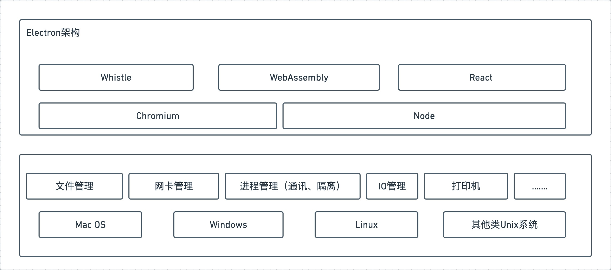
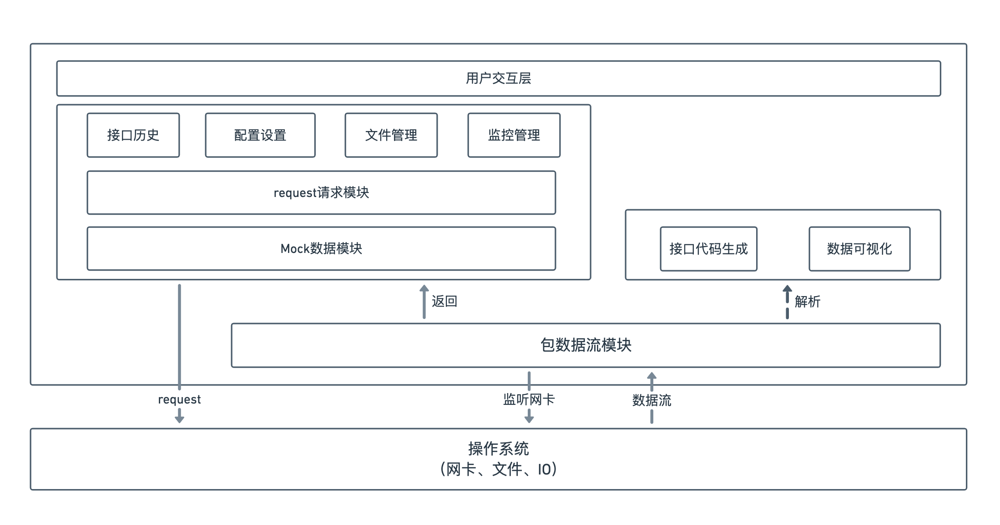

# 《基于Whistle和跨平台技术的高性能桌面网络代理系统设计与实现》

### 缑通旺 205544

## 一、选题依据与工程应用价值

### 1.1 选题依据

​	网络代理系统是通过监听计算机上操作系统提供的网卡接口，捕获所有经过网卡的数据帧，再根据不同层的网络协议解析，从而获取到网络数据包在产生和运输过程中的行为，使得用户可以利用获取到的数据信息进一步分析和应用。随着数字化时代的到来，人们无时无刻都在接触网络、使用网络来满足自己的需求。网络代理工具主要分为两种，一种是设置代理抓取http包，通过设置操作系统的代理，将请求由启动的服务代理，这样代理服务就获取到了经过的请求数据包。另一种是直接抓取经过网卡的所有协议包，这种方式不仅仅是抓去http协议，很多底层协议经过网卡的都会被获取到。

​	作为软件开发人员，我们都知道一个程序软件在正式上线之前，会有本地环境、测试环境、预发布环境、正式环境等等甚至更多。正因为有如此多的环境，那每个环境都有其差异性和特殊性。这样的方式是保证我们的产品在上线之前提前发现问题，解决问题，但同时这样的方式也会给开发过程带来一定的挑战和困难。环境的切换对于开发过程带来巨大的挑战，常常因为环境问题就给我们带来巨大的困难，

​	很多公司的内部都是一个小的局域网，我们在开发代码过程中，总是线上资源和本地资源不匹配，所以我们可以通过代理网络，把对本地的请求代理到对线上资源的请求，这样我们就可以在本地开发，但是资源是从线上获取的。

我们常说的VPN, 其实就是一种网络代理工具。

什么是好的开发环境？ 既然我们在讨论开发环境对于研发效率的影响，那我们先来看一看什么是好的开发环境。

稳定

好的开发环境首先应该是稳定可用的，不应该在开发测试的过程中频繁挂掉或者频繁发生改变。
依赖于后端日常接口进行调试的前端对这点应该深有体会，自己的问题还没解决，环境就时常带来新的问题。

快速验证

修改代码能够在尽可能短的时间内得到验证也是一个基本诉求，这也是为什么大部分前端构建都会关注 `Hot reload` 和更高级的 `HMR` 。

有些场景下的修改一次简单的修改就要经过长时间的等待，例如依赖上游修改接口的返回内容，需要修改后端的页面结构然后重新部署，需要走一遍完整的发布流程来测试某个修改在真实的线上页面会产生的影响等等。

这种改一行等几十分钟的开发方式对效率的拖累是极其恐怖的。

和线上的一致性

很多项目的线上环境极为复杂，为了解决日常开发中的问题，也会有一个线下的 `DEMO` 页面，最后开发完再搬到线上。

这种方式相对来说较为稳定且能快速验证，但比较凸显的问题在于和线上并不一致。开发中会存在很多 `if-else` 的逻辑，例如最常见的：

确定性

开发者对于当前的环境应该是有确切认知的，而不是一直不停的怀疑自己的配置到底有没有生效，命中的是不是又是缓存等等。

有些情况下我们利用 `hosts` 切换工具来进行联调，但在切完 `hosts` 后却又不得不来回确认自己的切换是否生效，清楚 Chrome 的 DNS Cache，清楚 Socket 之类的。

这种非确定性不但提高了开发者心智负担，而且也会导致 Bug 难以定位。

​	本论文通过分析电脑使用过程中的对网络流量根据自定义规则进行提取分析，

​		常见的网络代理工具有一系列缺点，比如功能不够丰富、不支持跨平台、无页面可操作性差、复杂度高等等。因此我们想要实现一个基于Whistle的跨平台的高性能的网络代理应用系统，通过抓包管理应用开发生命周期中接口的迭代同时通过代理提高对不同环境场景下的适应能力，致力于让开发人员能够精确的掌握自己的开发环境，通过代理使用规则转发、修改每一个请求和响应的内容；同时通过包信息反馈给开发人员，提升开发人员的效率和编程体验。

### 1.2 工程应用价值

​	当你的接口和页面突然不能工作了，代理工具可以快速mock一个，当想要测试一个线上页面改动可能会带来的后果，代理工具可以让你不经过复杂的发布过程快速在本地看到想要的效果。

为什么需要一个网络代理工具？

​	对于开发人员，网络代理工具能够更加准确的掌控当前的开发环境。开发环境是影响开发效能的最大因素之一，不可用的环境、不稳定的上游环境、线上本地环境的diff等等，都会严重影响开发体验与效率。并且管理的API, 帮助分析当前程序中的接口依赖程度，接口的稳定性，接口的管理等等，帮助你更好的开发体验。

​	对于运维人员，网络代理工具可以帮助排查线上问题，解决线上问题难查、难以复现的问题。

​	对于普通用户，网络代理工具可以帮助你可视化你的浏览历史，屏蔽请求

## 二、国内外研究现状与发展动态

我们要实现的是一个全面的、跨平台的、高性能的网络代理工具。

1、对于跨平台的研究

直接将语言编译成可执行文件，直接调用系统`API`，完成UI绘制等。这类开发技术，有着较高的运行效率，但一般来说，开发速度较慢，技术要求较高，例如：

- 使用`C++ / MFC`开发`Windows`应用
- 使用`Objective-C`开发`MAC`应用

为了提供原生系统的`GUI`支持，`Electron`内置了原生应用程序接口，对调用一些系统功能，如调用系统通知、打开系统文件夹提供支持。

在开发模式上，`Electron`在调用系统`API`和绘制界面上是分离开发的，下面我们来看看`Electron`关于进程如何划分。

Electron是一个基于Web构建桌面应用程序的底层工具框架。 它允许使用 Node.js 和 Chromium 完成桌面 GUI 应用程序的开发。通过嵌入Chromium 和 Node.js 到二进制的 Electron 可以构建跨平台桌面程序(Mac、Windows、Linux)。而C hromium是Google公司基于V8引擎

优点：

- 将 Chromium 与 Node.js 集成到同一个运行时环境中
- 不必考虑兼容性问题，只需关注 Chromium 版本即可
- 使用 Node 强大的API，可以使web页面操作文件，调用系统API，操作数据库…
- 也不必考虑跨域问题

缺点：

- 性能上比原生应用要低
- 最终打包后体积较大

当然这两个缺点也是跨平台的开发体验所带来的，所以要通过C++/Rust来编译WebAssebmly这种高性能编码来提高性能、减少体积，从而优化这两个缺点，也是我毕业设计需要研究和学习的地方。

2、对高性能编码WebAssembly的研究

WebAssembly(简称wasm) 是一个可移植、体积小、加载快并且兼容 Web 的全新格式，是一种新的编码方式，可以在现代的网络浏览器中运行。它是一种低级的类汇编语言，具有紧凑的二进制格式，可以接近原生的性能运行，并为诸如C / C ++ / Rust 等语言提供一个编译目标，以便它们可以在js runtime上运行。它也被设计为可以与JavaScript共存，允许两者一起工作。

一些其他抽象概念：

- 模块：表示一个已经被编译为可执行机器码的WebAssembly二进制代码。一个模块是无状态的，并且像一个二进制大对象（Blob）一样能够被缓存到IndexedDB中或者在windows和workers之间进行共享。
- 内存：ArrayBuffer，大小可变。本质上是连续的字节数组，WebAssembly的低级内存存取指令可以对它进行读写操作。
- 表格：带类型数组，大小可变。表格中的项存储了不能作为原始字节存储在内存里的对象的引用（为了安全和可移植性的原因）

3、对于网络工具的研究

​		网络代理相关的工具有很多，比如WireShark、Whistle、Charles、Postman还有国内互联网公司基于一些基础工具做的二次开发，为了更好的满足公司内部的需求。

​	whistle是基于 Node 实现的跨平台调试代理工具，主要用于查看、修改 HTTP、HTTPS、Websocket 的请求、响应，也可以作为 HTTP 代理服务器使用。在开发移动端网页的时候，我们不仅需要抓包，更想要真机能够直接访问到本地 server

​	

whistle基于Node实现的跨平台web调试代理工具，类似的工具有Windows平台上的Fiddler，主要用于查看、修改HTTP、HTTPS、Websocket的请求、响应，也可以作为HTTP代理服务器使用，whistle采用的是类似配置系统hosts的方式，一切操作都可以通过配置实现，支持域名、路径、正则表达式、通配符、通配路径等多种匹配方式.Whistle 不是入侵侦测系统（Instrusion Detection System)。Whistle不会产生警报或提示网络上的异常流量行为。但是，仔细分析Whistle捕获的数据包可以帮助用户更清楚地了解网络的行为。

​	因此，本论文将基于以上三个方面的前沿技术，结合作为开发者的需求体验，基于Electron、WebAssembly、Whistle以及其他相关技术，实现适当可行的网络代理系统，使其可以在多平台操作系统上进行正常使用。

## 三、研究内容以及研究目标

### 3.1 研究目标

​	本论文将基于Whistle和Electron架构，对网络代理应用系统做设计与实现。主要有两大目标，

第一目标是，功能目标，具体来说就是实现对网络数据包的捕获、对http协议的代理、数据包反解析为api、api的请求管理

第二目标是，跨平台目标，针对不同的操作系统，我们需要有不同的针对方案

第三目标是，优化目标，针对cpu密集型计算，我们要实现通过WebAssebmly高性能编码来优化性能

### 3.2 研究内容

主要的研究内容分为以下几个方面，

- 首先是网络代理系统的需求分析，通过需求分析明确网络代理系统的基本功能和使用场景，明确开发过程中需要用到的技术。
- 网络代理系统的设计，根据需求分析，进行设计。设计主要是真的我们掌握的技术，针对不同的技术场景合理规划。尤其是性能部分，使用相应的优化手段进行设计。
- 网络代理系统的实现，根据设计的架构图、功能需求图等设计，实现系统。
- 网络代理系统的测试，对实现的系统进行功能性测试和非功能性测试，同时对测试结果进行评估。

#### 3.2.1 需求分析

​	首先，我们要明确我们的系统主要使用目标人群以及使用场景，我们是针对开发人员或者有一定网络代理需求的用户开发的一个工具系统，这个系统要满足跨平台、高性能、网络信息流捕获等等要求，基于此，我们分为功能性需求和非功能性需求。

(1) 功能需求

+ 网络信息流捕获
+ http请求接口管理
+ http包反析

(2) 非功能需求

+ 跨平台

+ 高性能

#### 3.2.2 系统设计

整体架构设计

(1) 功能模块设计

根据需求分析的三个功能需求，我们分别设计

 

#### 3.2.3 系统实现

​	完成系统的设计后，我们利用JavaScript对代替原来的GUI开发桌面应用。对于性能优化，则需要使用C++或者Rust编译为WebAssembly来进行开发。

​	在系统实现的过程中，我们首先对各个功能模块进行实现，因为每个功能模块的功能都很明确，

#### 3.2.4 系统测试

- 功能性测试

  

- 非功能性测试

## 四、实施方案与可行性分析

### 4.1 研究基础

### 4.2 相关技术方案

### 4.3 可行性分析

​	自身掌握开发中所需要的的编程语言JavaScript和C++，对跨平台设计有一定了解，前期通过阅读文献和在公司实际开发实习积累相关的经验，熟悉了在开发过程中使用的React、Whistle、WebAssembly、Electron基本框架，初步分析表明本方案具备可行性。校内外导师对相关领域具备专业能力，对沦为撰写具有指导学生的经验。

## 五、参考文献

 [1]罗青林,徐克付,臧文羽,刘金刚.Wireshark环境下的网络协议解析与验证方法[J].计算机工程与设计,2011,32(03):770-773.DOI:10.16208/j.issn1000-7024.2011.03.068.

[2]Andreas Haas,Andreas Rossberg,Derek L. Schuff,Ben L. Titzer,Michael Holman,Dan Gohman,Luke Wagner,Alon Zakai,JF Bastien. Bringing the web up to speed with WebAssembly[P]. Programming Language Design and Implementation,2017.

