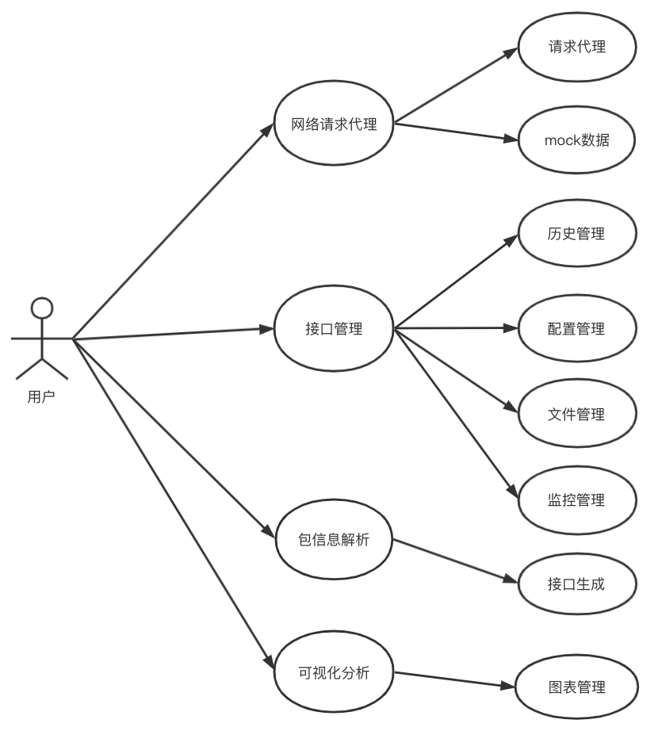
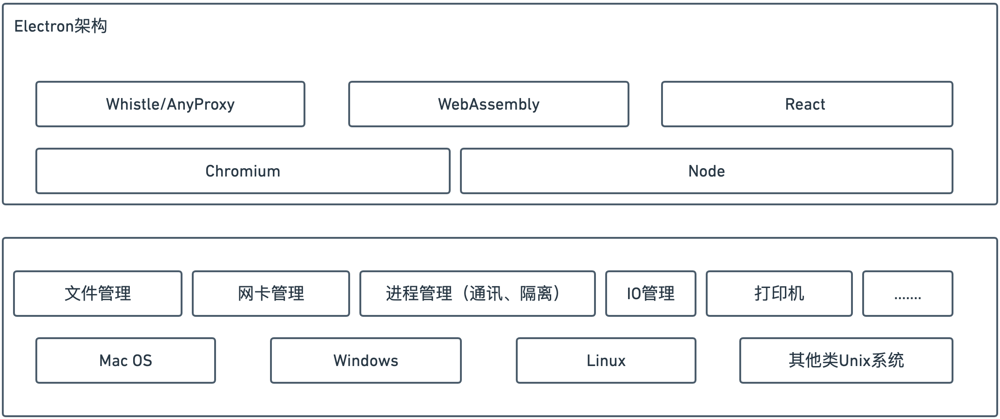
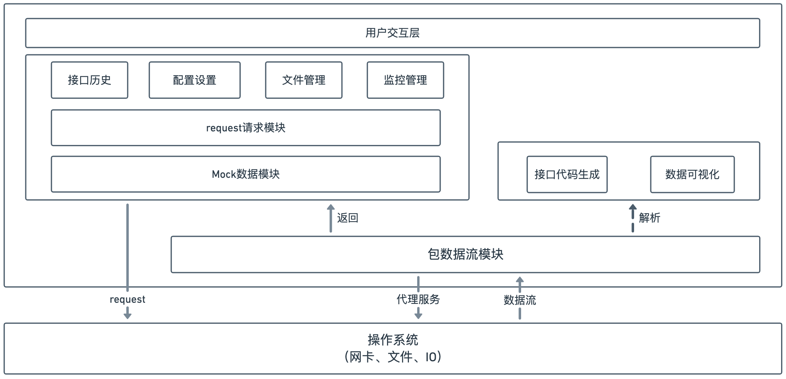

# 《基于WASM的跨平台技术的桌面网络代理系统设计与实现》

### 缑通旺 205544

## 一、选题依据与工程应用价值

### 1.1 选题依据

​	网络代理系统是通过捕获计算机的网络请求，将捕获到的数据根据不同网络层的网络协议解析成不同的报文信息，再进一步对报文信息解析和统计，以满足使用者的需求。在这个网络高度普及的世界，我们每一台终端，无论是电脑、平板还是手机，甚至一些IOT设备都与网络紧密连接从而满足我们的日常生活。作为程序员，电脑是我们的第一生产力工具。在日常开发中，我们经常需要在本地开发去连接不同的线上资源环境进行测试、开发、调试等等。而频繁的切换开发环境无疑是一件重复的低效率的操作，所以通过网络代理工具可以高效率的切换环境。同时开发过程我们需要经常的调试接口、管理api，而网络代理工具也可以在这些方向做出贡献。随着，云时代的来临，线上环境更加斑驳繁杂、应用系统的生命周期管理等都会面临更大的挑战，通过网络代理工具可以更加智能化应对这些挑战。

​	网络代理的目前实现方式主要分为两种：一种是通过直接监听计算机上操作系统提供的网卡接口，捕获所有经过网卡的数据帧，再根据不同层的网络协议解析，从而获取到网络数据包在产生和运输过程中的行为；第二种是通过启动一个代理服务，然后将计算机上的HTTP/HTTPS请求都通过代理服务代理，从而实现代理服务对请求数据包的捕获。

​	目前，关于网络代理的解决方案，大型互联网公司在原有的一些工具上做二次开发，以满足特定的差异化需求。常见的网络代理工具有一些缺点，比如功能不够丰富、不支持跨平台、无页面可操作性差、复杂度高等等。因此我通过毕业设计想要实现一个基于node代理http/https请求的跨平台的高性能的网络代理应用系统，通过抓包管理应用开发生命周期中接口的迭代同时通过代理提高对不同环境场景下的适应能力，致力于让开发人员能够精确的掌握自己的开发环境，通过代理使用规则转发、修改每一个请求和响应的内容；同时通过包信息解析反馈给开发人员，提升开发人员的效率和编程体验。

### 1.2 工程应用价值

​		作为软件开发人员，我们都知道一个软件功能在上线之前，大概会有本地环境、测试环境、预发布环境、正式环境、分地区环境等等甚至更多。正因为有如此多的环境，那每个环境都有其差异性和特殊性。虽然这样的方式是保证我们的产品在上线之前可以更多的发现问题，提高线上服务的稳定性，但同时这样的方式也会给开发过程带来一定的挑战和困难。同样，我们在开发一个软件的过程是漫长的，软件版本可能在这个过程迭代了很多次，那如何管理软件生命周期过程中接口迭代也是我们面临的挑战。

​		正因为有这么多问题和挑战，我们需要思考一个问题，什么是良好的开发环境和开发体验？为什么能通过网络代理工具改善开发环境进而提高研发效率与体验。

- 稳定性

​        好的开发环境首先应该是稳定可用的，不应该在开发测试的过程中频繁挂掉或者频繁发生改变。依赖于后端日常接口进行调试的前端对这点应该深有体会，自己的问题还没解决，环境就时常带来新的问题。

- 快速验证

​       修改代码能够在尽可能短的时间内得到验证也是一个基本诉求，这也是为什么大部分前端构建都会关注 `Hot reload` 和更高级的 `HMR` 。有些场景下的修改一次简单的修改就要经过长时间的等待，例如依赖上游修改接口的返回内容，需要修改后端的页面结构然后重新部署，需要走一遍完整的发布流程来测试某个修改在真实的线上页面会产生的影响等等。这种改一行等几十分钟的开发方式对效率的拖累是极其恐怖的。

​	当你的接口和页面突然不能工作了，代理工具可以快速mock一个，当想要测试一个线上页面改动可能会带来的后果，代理工具可以让你不经过复杂的发布过程快速在本地看到想要的效果。

- 环境一致性

​       很多项目的线上环境极为复杂，为了解决日常开发中的问题，也会有一个线下的 `DEMO` 页面，最后开发完再搬到线上。这种方式相对来说较为稳定且能快速验证，但比较凸显的问题在于和线上并不一致。

- 确定性

​       开发者对于当前的环境应该是有确切认知的，而不是一直不停的怀疑自己的配置到底有没有生效，命中的是不是又是缓存等等。有些情况下我们利用 `hosts` 切换工具来进行联调，但在切完 `hosts` 后却又不得不来回确认自己的切换是否生效，清楚 Chrome 的 DNS Cache，清楚 Socket 之类的。这种非确定性不但提高了开发者心智负担，而且也会导致 Bug 难以定位。

​	

所以使用网络代理工具

​	对于开发人员，网络代理工具能够更加准确的掌控当前的开发环境。开发环境是影响开发效能的最大因素之一，不可用的环境、不稳定的上游环境、线上本地环境的diff等等，都会严重影响开发体验与效率。并且管理的API, 帮助分析当前程序中的接口依赖程度，接口的稳定性，接口的管理等等，帮助你更好的开发体验。

​	对于运维人员，网络代理工具可以帮助排查线上问题，解决线上问题难查、难以复现的问题。

​	对于普通用户，网络代理工具可以帮助你可视化你的浏览历史，屏蔽请求

## 二、国内外研究现状与发展动态

实现的是一个跨平台的、高性能的网络代理工具。

1、对于桌面应用跨平台的研究

从nw.js到Electron, Electron是2014年正式开源垮桌面应用技术

直接将语言编译成可执行文件，直接调用系统`API`，完成UI绘制等。这类开发技术，有着较高的运行效率，但一般来说，开发速度较慢，技术要求较高，例如：

- 使用`C++ / MFC`开发`Windows`应用
- 使用`Objective-C`开发`MAC`应用

为了提供原生系统的`GUI`支持，`Electron`内置了原生应用程序接口，对调用一些系统功能，如调用系统通知、打开系统文件夹提供支持。

在开发模式上，`Electron`在调用系统`API`和绘制界面上是分离开发的，下面我们来看看`Electron`关于进程如何划分。

Electron是一个基于Web构建桌面应用程序的底层工具框架。 它允许使用 Node.js 和 Chromium 完成桌面 GUI 应用程序的开发。通过嵌入Chromium 和 Node.js 到二进制的 Electron 可以构建跨平台桌面程序(Mac、Windows、Linux)。而C hromium是Google公司基于V8引擎

优点：

- 将 Chromium 与 Node.js 集成到同一个运行时环境中
- 不必考虑兼容性问题，只需关注 Chromium 版本即可
- 使用 Node 强大的API，可以使web页面操作文件，调用系统API，操作数据库…
- 也不必考虑跨域问题

缺点：

- 性能上比原生应用要低
- 最终打包后体积较大

当然这两个缺点也是跨平台的开发体验所带来的，所以要通过C++/Rust来编译WebAssebmly这种高性能编码来提高性能、减少体积，从而优化这两个缺点，也是我毕业设计需要研究和学习的地方。

2、对高性能编码WebAssembly的研究

WebAssembly(简称wasm) 是一个可移植、体积小、加载快并且兼容 Web 的全新格式，是一种新的编码方式，可以在现代的网络浏览器中运行。它是一种低级的类汇编语言，具有紧凑的二进制格式，可以接近原生的性能运行，并为诸如C / C ++ / Rust 等语言提供一个编译目标，以便它们可以在js runtime上运行。它也被设计为可以与JavaScript共存，允许两者一起工作。

一些其他抽象概念：

- 模块：表示一个已经被编译为可执行机器码的WebAssembly二进制代码。一个模块是无状态的，并且像一个二进制大对象（Blob）一样能够被缓存到IndexedDB中或者在windows和workers之间进行共享。
- 内存：ArrayBuffer，大小可变。本质上是连续的字节数组，WebAssembly的低级内存存取指令可以对它进行读写操作。
- 表格：带类型数组，大小可变。表格中的项存储了不能作为原始字节存储在内存里的对象的引用（为了安全和可移植性的原因）

3、对于网络工具的研究

​		网络代理相关的工具有很多，比如WireShark、Whistle、Charles、Postman还有国内互联网公司基于一些基础工具做的二次开发，为了更好的满足公司内部的需求。

​	whistle是基于 Node 实现的跨平台调试代理工具，主要用于查看、修改 HTTP、HTTPS、Websocket 的请求、响应，也可以作为 HTTP 代理服务器使用。在开发移动端网页的时候，我们不仅需要抓包，更想要真机能够直接访问到本地 server

​	whistle基于Node实现的跨平台web调试代理工具，类似的工具有Windows平台上的Fiddler，主要用于查看、修改HTTP、HTTPS、Websocket的请求、响应，也可以作为HTTP代理服务器使用，whistle采用的是类似配置系统hosts的方式，一切操作都可以通过配置实现，支持域名、路径、正则表达式、通配符、通配路径等多种匹配方式.Whistle 不是入侵侦测系统（Instrusion Detection System)。Whistle不会产生警报或提示网络上的异常流量行为。但是，仔细分析Whistle捕获的数据包可以帮助用户更清楚地了解网络的行为。

​	因此，本论文将基于以上三个方面的前沿技术，结合作为开发者的需求体验，基于Electron、WebAssembly、Whistle以及其他相关技术，实现适当可行的网络代理系统，使其可以在多平台操作系统上进行正常使用。

## 三、研究内容以及研究目标

### 3.1 研究目标

​	本论文将基于WebAssembly、anyproxy以及Electron架构，对网络代理应用系统做设计与实现。主要有三大目标：

第一目标是，功能目标，具体来说就是实现对网络数据包的捕获、对http/https协议请求的代理、数据包解析、应用接口的迭代管理

第二目标是，跨平台目标，针对不同的操作系统，我们需要有不同的针对方案

第三目标是，优化目标，针对cpu密集型计算，尤其是可视化部分、网络请求分析模块的实现可以通过WebAssebmly高性能编码来优化性能

### 3.2 研究内容

主要的研究内容分为以下几个方面，

- 首先是网络代理系统的需求分析，通过需求分析明确网络代理系统的基本功能和使用场景，明确开发过程中需要用到的技术。
- 网络代理系统的设计，根据需求分析，进行设计。设计主要是真的我们掌握的技术，针对不同的技术场景合理规划。尤其是性能部分，使用相应的优化手段进行设计。
- 网络代理系统的实现，根据设计的架构图、功能需求图等设计，实现系统。
- 网络代理系统的测试，对实现的系统进行功能性测试和非功能性测试，同时对测试结果进行评估。

#### 3.2.1 需求分析

​	首先，我们要明确我们的系统主要使用目标人群以及使用场景，我们是针对开发人员或者有一定网络代理需求的用户开发的一个工具系统，这个系统要满足跨平台、高性能、网络信息流捕获等等要求，基于此，我们分为功能性需求和非功能性需求。

(1) 功能需求

+ 网络请求代理
+ 接口管理
+ 包信息解析
+ 应用生命周期管理

用例图

以上是整个系统的用例图，可以拆分为四个模块

1、

用例名称：网络请求代理用例

参与者：用户

说明：用户通过规则设置对特定请求进行请求头、mock数据代理

前置条件：用户计算机系统成功设置代理服务

后置条件：请求按照我们的规则生效

2、

用例名称：接口管理用例

参与者：用户

说明：用户通过设置请求的相关信息，成功在系统中请求，并对请求进行管理

前置条件：用户计算机系统成功设置代理服务

后置条件：请求正常工作并分类管理

3、

用例名称：包信息解析用例

参与者：用户

说明：用户通过对捕获的网络请求包进行分析，解析并生成请求代码

前置条件：用户计算机系统成功设置代理服务并且对用户请求成功捕获

后置条件：请求按照我们的规则生效

4、

用例名称：应用生命周期管理用例

参与者：用户

说明：用户再一段时间内所设置的特定接口进行数据管理

前置条件：用户计算机系统成功设置代理服务并且对用户请求成功捕获

后置条件：数据以时间为主线，多维度展开

(2) 非功能需求

+ 跨平台
+ 高性能

#### 3.2.2 系统设计

整体架构设计

(1) 功能模块设计

根据需求分析的三个功能需求，我们整体的功能模块图

 

#### 3.2.3 系统实现

​	完成系统的设计后，我们利用JavaScript对代替原来的GUI开发桌面应用。对于性能优化，则需要使用C++或者Rust编译为WebAssembly来进行开发。

​	在系统实现的过程中，我们首先对各个功能模块进行实现，因为每个功能模块的功能都很明确，

#### 3.2.4 系统测试

- 功能性测试

  主要是对需求部分提出来的需求分别进行测试。

- 非功能性测试

  非功能性测试主要分为跨平台和高性能

  跨平台必须满足在Window、Mac、Linux实现可下载安装、可正常使用大部分功能。

  高性能需要对比同等条件下，与不使用WASM编码方式做横向比较

## 四、实施方案与可行性分析

### 4.1 研究基础

​	桌面跨平台技术是追求开发一致性以及抹平底层差异，解放程序员生产力的重要技术。WASM编码技术让缩小了JavaScript语言本身带来的性能问题，让Web技术可以更好的服务。网络代理工具更是保障程序员在多环境、上下线的情况下，提升开发体验，提高效率，保障应用的生命周期。本论文要实现的桌面应用系统的功能需求和非功能需求，功能需求包括：网络请求代理、接口管理、包信息解析、应用生命周期管理；非功能需求包括：实现跨平台和Wasm编码提高性能。

### 4.2 相关技术方案

#### 4.2.1 Electron

- 1.1 Electron运行原理

Electron结合了Chromium、Node.js和用于调用操作系统本地功能的API，能够使用纯JavaScript来创建桌面应用。

(1)Node.js。

Node.js是一个JavaScript运行环境，是对Google V8引擎进行了封装，用于方便地搭建响应速度快、易于扩展的网络应用。Node.js使用事件驱动、非阻塞I/O模型而得以轻量和高效，非常适合在分布式环境中运行数据密集时实时应用。

(2）系统API。

为了提供原生系统的GUI支持，Electron内置了原生应用程序接口，对调用一些系统功能，如调用系统通知、打开系统文件夹、访问操作系统剪贴板等提供支持。

(3）进程类别。

Electron区分了两种进程：主进程和渲染进程。

一个Electron应用总是有且只有一个主进程，主进程职责：

1）创建渲染进程（可多个）；

2）控制应用生命周期（启动、退出APP以及对APP做一些事件监听）；

3）调用系统底层功能，调用原生资源。

渲染进程相当于一个浏览器窗口，其主要职责：

1）用HTML和CSS渲染界面；

2）用JavaScript做一些界面交互。

- 1.2 Electron技术优势

Web应用主要受限于网络和浏览器特性，因此，桌面应用在以下方面要优于Web应用：

(1）可以即时启动，不需要等待资源从网络下载下来。

(2）可以访问计算机的操作系统和硬件资源，包括可以读写用户计算机中的文件系统。

(3）可以更好地控制软件的用户体验，不需要担心不同浏览器兼容性问题。

Electron技术除了通用的优势外，还有以下特别的优势：

(1）可以用Web前端技术开发跨平台的桌面应用：使用纯JavaScript语言开发，只需要写一份代码，打包出来的应用可以同时在Windows、Linux、Mac操作系统上运行。

(2）可以从Node.js的生态获得极大的助力：Node.js这个大生态下很多成熟模块可以直接引入使用，避免重复造轮子，提高开发效率。

(3）进程隔离：基于Chromium多进程模式的应用模块集成，天然提供了应用模块之间的隔离性，其中某一应用模块的死机故障不影响其他应用模块及整个应用软件。

#### 4.2.2 WASM

WebAssembly是可移植、体积小、加载快并且兼容Web的一种新的字节码格式，主流浏览器都已经支持WebAssembly。WebAssembly字节码和底层机器码很相似，可快速装载运行，因此性能相对于JS解释执行大大提升。WebAssembly作为一份字节码标准，需要用高级编程语言编译出字节码放到WebAssembly虚拟机中才能运行，浏览器厂商根据WebAssembly规范实现虚拟机。

对于网络平台而言，WebAssembly具有巨大的意义——它提供了一条途径，使得以各种语言编写的代码都可以以接近原生的速度在Web中运行。在这种情况下，以前无法以此方式运行的客户端软件都将可以在Web中运行。而且，这是W3C WebAssembly Community Group开发的一项网络标准，各大主要浏览器厂商都积极参与。

以下主要阐述基于WebAssembly的边缘计算架构的技术特性。

- 跨平台性

WebAssembly字节码是一种抹平了不同CPU(central processing unit，中央处理器）架构的机器码，WebAssembly字节码不能直接在任何一种CPU架构上运行，但由于非常接近机器码，可以非常快地被翻译为对应架构的机器码，因此WebAssembly运行速度和机器码接近。

WebAssembly有如下优点。

体积小：由于浏览器运行时只加载编译成的字节码，同样的逻辑比用字符串描述的JS文件体积要小很多。

加载快：由于文件体积小，再加上无需解释执行，WebAssembly能更快地加载并实例化，减少运行前的等待时间。

兼容性问题少：WebAssembly是非常底层的字节码规范，制订好后很少变动，就算以后发生变化，也只需在从高级语言编译成字节码的过程中做兼容。可能出现兼容性问题的地方在于JS和WebAssembly桥接的JS接口。

每个高级语言源码到不同平台的机器码的转换工作是重复的，高级语言只需要生成底层虚拟机（low level virtual machine,LLVM）认识的中间语言（LLVM intermediate representation,LLVM IR),LLVM能实现LLVM IR到不同CPU架构机器码的生成、机器码编译时性能和大小的优化。除此之外，LLVM还能实现LLVM IR到Web Assembly字节码的编译功能，也就是说只要高级语言能转换成LLVM IR，就能被编译成Web Assembly字节码，目前能编译成Web Assembly字节码的高级语言有以下几种。

AssemblyScript：语法和TypeScript一致，对前端来说学习成本低，是前端编写WebAssembly最佳选择。

c/c++：官方推荐的方式。

Rust：语法复杂，学习成本高，对前端来说可能会不适应。

Kotlin：语法和Java、JS相似，语言学习成本低。

Golang：语法简单，学习成本低，但对WebAssembly的支持还处于未正式发布阶段。

通常负责把高级语言翻译成LLVM IR的部分叫作编译器前端，把LLVM IR编译成各架构CPU对应机器码的部分叫作编译器后端；现在越来越多的高级编程语言选择LLVM作为后端，高级语言只需专注于提供开发效率更高的语法，同时保持翻译到LLVM IR程序的执行性能。

- 性能

WebAssembly适合用于需要大量计算的场景，例如以下场景。

在浏览器中处理音视频，flv.js用Web Assembly重写后性能会有很大提升。

React的dom diff中涉及大量计算，用WebAssembly重写React核心模块能提升性能。

Safari浏览器使用的JS引擎JavaScriptCore也已经支持WebAssembly,RN应用性能也能提升。

突破大型3D网页游戏性能瓶颈，白鹭引擎已经开始探索用WebAssembly。

#### 4.2.3 基于node的http代理

基于Node实现的跨平台web调试代理工具，类似的工具有Windows平台上的Fiddler，主要用于查看、修改HTTP、HTTPS、Websocket的请求、响应，也可以作为HTTP代理服务器使用，不同于Fiddler通过断点修改请求响应的方式，whistle采用的是类似配置系统hosts的方式，一切操作都可以通过配置实现，支持域名、路径、正则表达式、通配符、通配路径等多种匹配方式，且可以通过Node模块扩展功能。

### 4.3 可行性分析

​	自身掌握开发中所需要的的编程语言JavaScript和C++，对跨平台设计有一定了解，前期通过阅读文献和在公司实际开发实习积累相关的经验，熟悉了在开发过程中使用的React、Whistle、WebAssembly、Electron等等一些基本框架和技术，初步分析表明本方案具备可行性。校内外导师对相关领域具备专业能力，对论文撰写具有指导学生的经验。

## 五、参考文献

 [1]罗青林,徐克付,臧文羽,刘金刚.Wireshark环境下的网络协议解析与验证方法[J].计算机工程与设计,2011,32(03):770-773.DOI:10.16208/j.issn1000-7024.2011.03.068.

[2]Andreas Haas,Andreas Rossberg,Derek L. Schuff,Ben L. Titzer,Michael Holman,Dan Gohman,Luke Wagner,Alon Zakai,JF Bastien. Bringing the web up to speed with WebAssembly[P]. Programming Language Design and Implementation,2017.

[3]Toman Zinah Hussein,Toman Sarah Hussein,Hazar Manar Joundy. An In-Depth Comparison Of Software Frameworks For Developing Desktop Applications Using Web Technologies[J]. Journal of Southwest Jiaotong University,2019,54(4):

[4]薛超. 基于WebAssembly的JavaScript性能优化方案研究与实现[D].西北大学,2019.

