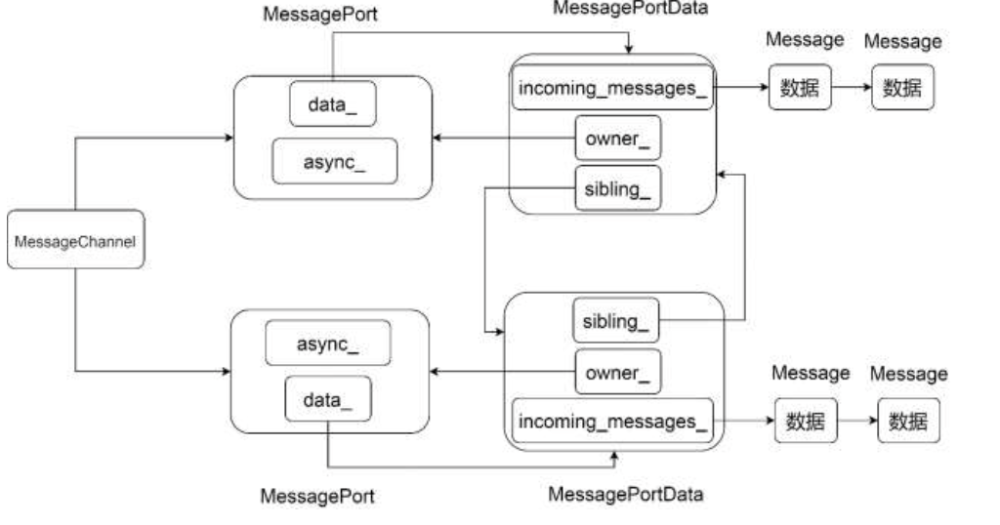
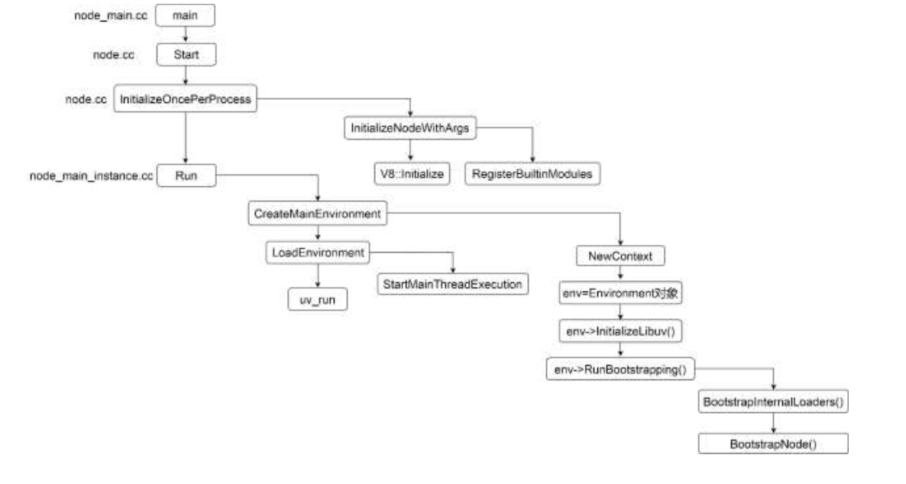
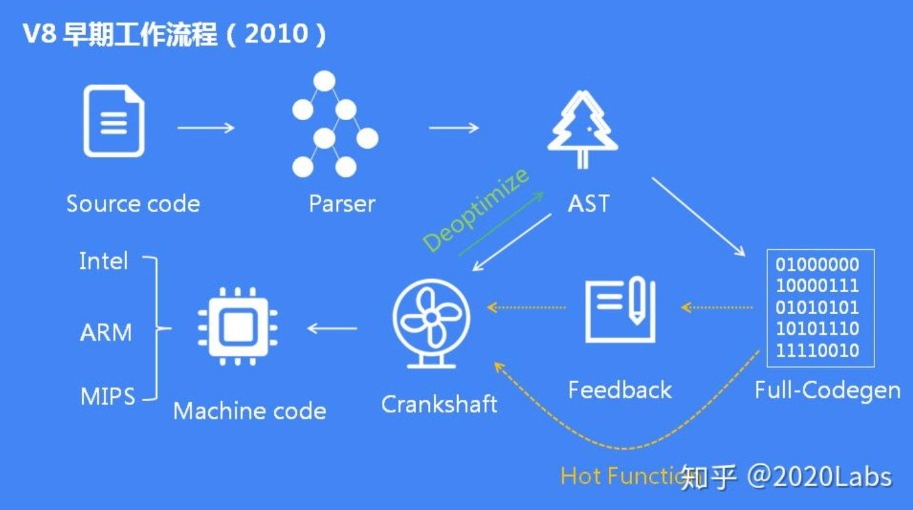
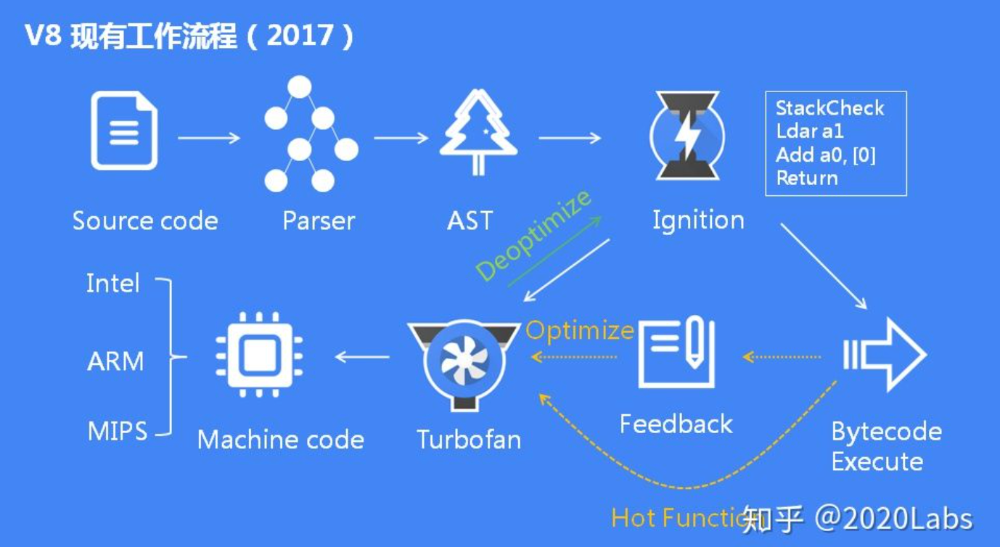

# 小论文

# 待选：v8运行引擎和跨语言调用原理

# 待选： 基于ElectronJs跨端技术的流程模型原理 

> https://segmentfault.com/a/1190000040102915
>
> https://juejin.cn/post/6966626823912308772
>
> https://blog.5udou.cn/#/blog/detail/Hao-Shi-Liang-Ge-Yue-Wang-Shang-Zui-Quan-De-Yuan-Chuang-nodejsShen-Ru-Xi-Lie-Wen-Zhang-Chang-Da-Shi-Lai-Wan-Zi-De-Wen-Zhang-Huan-Ying-Shou-Cang-54


「一般来说，跨端技术有 4 类场景，分别是跨设备平台（跨`Web`端和手机端）、跨操作系统（如跨`Android`和`iOS`）、跨`App`以及跨渲染容器。」

需要解决性能、动态性、研发效率以及一致性的问题。

> **性能：** 如何通过前端和客户端的结合，实现更优的渲染性能以及交互性能;
>
> **动态性：** 客户端怎样能够实现更低成本的发版、甚至不发版直接动态更新代码；
> 研发效率：如何提升不同客户端的动态调试之类的研发效率；
>
> **一致性：** 如何实现一份代码的多端部署，并保证代码在多个客户端内展示形态的一致性以及兼容性问题。


ElectronJs是一个在2013年开源的基于Chromium和NodeJs的跨操作系统的桌面应用开发框架。


## 主要模块

Nodejs主要负责应用程序主线程逻辑控制、底层交互等功能，Chromium主要负责渲染线程窗口的业务逻辑。

本节分为两个模块探究其原理

Electron主要分为了逻辑进程和渲染进程，渲染进程主要是对每一打开的页面进行渲染，而逻辑进程主要是通过基于V8的NodeJs高性能API与系统层面API进行交互，提供应用原生操作的体验，比如访问系统文件夹、网络、等等。

### 1、Chromium

同样，浏览器中任何一个行为不当的网页也可能如此。一个页面或插件的错误就可能让整个浏览器崩溃。

Chromium也做了类似的设计，它把每个页面约束在单独的进程中，以保护整个浏览器不受单个页面中的故障影响。它甚至还限制了每个页面进程对其他进程和系统其他部分的访问，这极大地缓解了浏览器容易崩溃的问题。Chromium把管理页面、管理选项卡和插件的进程称为主进程。把特定于页面的进程称为渲染进程。


渲染进程使用Blink开源布局引擎来解释和渲染HTML。渲染进程与主进程通过IPC管道进行通信。

每个渲染进程都对应一个全局的RenderProcess对象，都有一个或多个RenderView对象。RenderProcess对象负责与主进程通信并管理这些RenderView对象，通常每个新窗口或选项卡都会在新进程中打开。

主进程负责创建这些新的进程，并指示它们创建各自的RenderView对象。


由于渲染进程运行在一个单独的进程中，所有页面脚本都在此进程中运行，当页面脚本尝试访问网络或本地资源时，当前渲染进程并不提供这样的服务，而是发消息给主进程，由主进程完成相应的工作，此时主进程会判断这些操作是否合法，比如跨越同源策略的请求、突破限制访问Cookie、https页面内内嵌http的页面等，这些行为都是不合法的行为，主进程可以拒绝提供服务，这就是浏览器的沙箱模式。


多进程模式并不是没有缺点，比如每个进程都会包含公共基础结构的副本（例如V8引擎的执行环境）、更复杂的通信模型等，这都意味着浏览器会消耗更多的内存、CPU甚至电能。

### 2、NodeJs

​	NodeJs是基于高性能V8的JavaScript执行引擎的一个服务端框架，融合了很多基础库，构建了一个单进程异步。

​	Node基于V8的JS运行时，它利用V8提供的能力，极大地拓展了JS的能力，这种拓展不是为了JS增加了新的语言特性，而是拓展了功能模块。例如JS本身并没有网络相关的功能，但是通过Node扩展，可以让我们通过JS调用底层的C++模块的TCP，从而赋予网络编程的能力。

​	Node.js 中最核心的部分是 Libuv 和 V8，V8 不仅负责执 行 JS，还支持自定义的拓展，实现了 JS 调用 C++和 C++调用 JS 的能力。JS 层调用的所有 C、C++模块都是通过 V8 来完成的。


​	Node的架构底层是一些c++的基础库、libuv、SSL、c-cares等等，赋予了Node高效的系统层api。在C++和JavaScript中间定义了相互调用的胶水代码，同时利用JavaScript构建了一套包加载机制，赋予了JS项目级别的管理能力。


回调的时候，c++的回调最后可能要回调到js层


#### 线程之间的通讯

1、共享内存

2、不共享栈




NodeJS的是单进程单线程的架构，但是在当前的机器上都是多核架构。但是NodeJS通过Cluster模块模拟，以最大限度的利用多核架构的性能。而 cluster 模块在 child_process 模块的基础上使得多个进程可以监听的同一个端口，实现服务器的多进程架构。

正常情况下，一个进程只能监听一个端口，如果对端口重复监听，会上报EADDRINUSE错误，但是NodeJs通过传递文件描述符实现并不报错。


管道化是对数据从一个地方流向另一个地方的抽象。


#### 如何拓展c++ 

Node扩展一个process对象，通过process.binding拓展js功能。Node.js定义一个全局JS对象Process映射到一个c++对象process，底层维护了一个c++模块的链表。Js访问Process对象，从而进一步访问到C++模块。



在InitializeOnceperProcesss部分，会先把内置的c++模块，比如DNS、HTTP等c++模块注册到一个链表中，为了后续使用时查找。

```c++
extern "C" void node_module_register(void* m) {
  struct node_module* mp = reinterpret_cast<struct node_module*>(m);

  if (mp->nm_flags & NM_F_INTERNAL) {
    mp->nm_link = modlist_internal;
    modlist_internal = mp;
  } else if (!node_is_initialized) {
    // "Linked" modules are included as part of the node project.
    // Like builtins they are registered *before* node::Init runs.
    mp->nm_flags = NM_F_LINKED;
    mp->nm_link = modlist_linked;
    modlist_linked = mp;
  } else {
    thread_local_modpending = mp;
  }
}

最后都会调用一个module注册函数，如果是内置c++模块，就调用第一个if NM_F_INTERNAL为true；
  其他情况对应的是用户自己扩展的c++，初始化时加载还是运行时再连接进来（个人理解，需进一步确认）
```


## 3、V8.js

>
>
>https://zhuanlan.zhihu.com/p/96969423

无论是chromium + Node再执行js都需要V8高性能引擎的执行效率。

V8相比较一些其他的早期JavaScript引擎，它将source code直接编译成了机器码，而不是字节码。







Ignition的字节码可以直接用TurboFan生成优化的机器代码，而不必像Crankshaft那样从源代码重新编译。Ignition的字节码在V8中提供了更清晰且更不容易出错的基线执行模型，简化了去优化机制，这是V8 自适应优化的关键特性。最后，由于生成字节码比生成Full-codegen的基线编译代码更快，因此激活Ignition通常会改善脚本启动时间，从而改善网页加载。

TurboFan是V8的优化编译器，TurboFan项目最初于2013年底启动，旨在解决Crankshaft的缺点。Crankshaft只能优化JavaScript语言的子集。


## 主要概念

### 1、上下文隔离

### 2、沙盒

### 3、不同操作系统考虑

比如MacOS的关闭可能只是页面上的关闭，而Windows的关闭是直接退出

在 MacOS 和 Ubuntu, 托盘将位于屏幕右上角上，靠近你的电池和wifi 图标。 在 Windows 上，托盘通常位于右下角。


# 参考链接

张佳伟,张涛,周叶. 基于Electron的跨平台客户端技术[J]. 智能计算机与应用,2017,7(3):120-122.