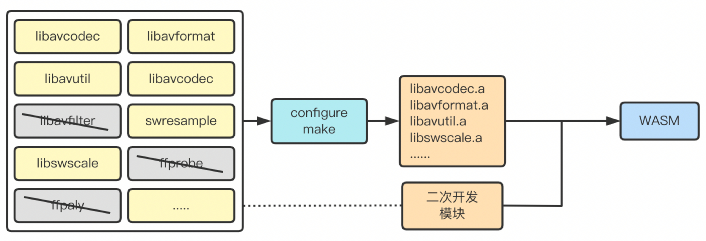
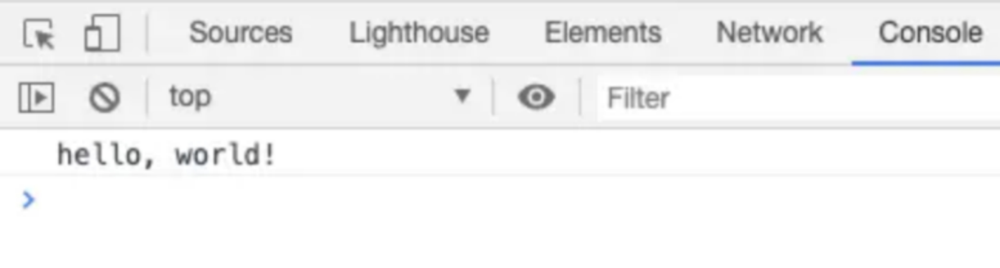
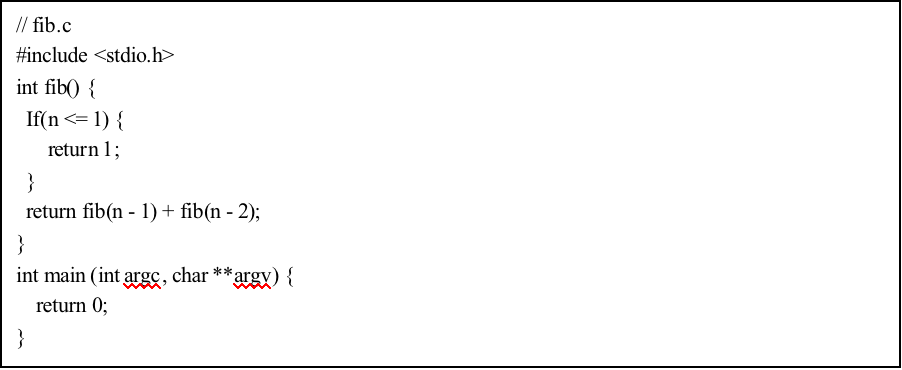
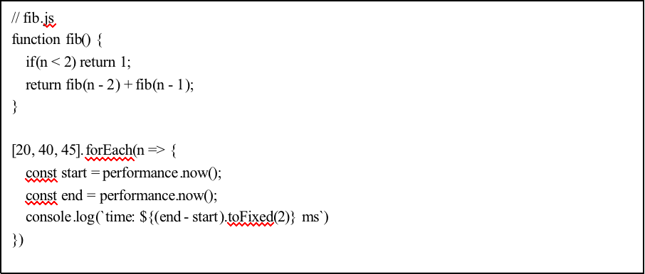
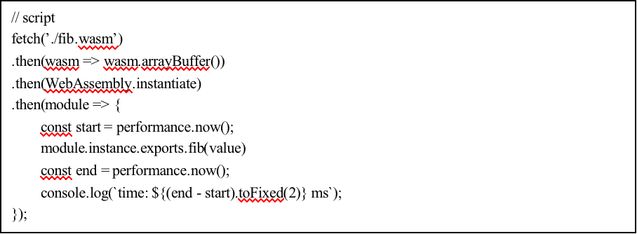

基于WebAssembly和WebGL的浏览器播放H.265编码视频的方法研究

> WebGL vs canvas https://zhuanlan.zhihu.com/p/350323062

## 摘要

​	针对大部分浏览器还不支持H.265编码类型的视频播放，虽然H.265编码类型有极为优异的性能，但是H.265不是开源，大部分浏览器都没有实现对H.265编码类型的视频播放。基于此，本文提出针对不同的H.265编码类型的视频流来源，通过WebAssembly和WebGL将解码工作放在客户端直接解码播放，通过WebAssembly二进制编码将视频快速解码，并通过WebGL渲染到浏览器上。

## 背景

​	随着视频深度渗透、全面融入人们生活，视频成为网民表达自身情感、生活、想法的工具。H.265是一种高质量的视频编码方式，在视频传输以及处理中具有重要的意义。在实时视频直播应用上，浏览器端相对于C/S端有很多短板，传统的Web视频播放是通过Canvas+Audio进行渲染播放，这种方案具有延时性大、卡顿、部分格式不支持的问题，很难满足实际生产需要。针对这个问题，本文提出一种基于基于WebAssembly和WebGL绘制H.265码流视频播放方法，根据本文的方法可以实现浏览器端实时预览功能，其播放视频具有低延时性，不容易断流，可控性强等优点。

## 系统架构

​	基于WebAssembly和WebGL的浏览器H.265编码类型的视频播放系统架构图如图所示：

​	

## 系统实施技术

2.1 WebGL渲染技术

​	简言之，尽管现代浏览器都为canvas 2d和webGL提供硬件加速的支持，但webGL在渲染数量众多的元素或像素时，性能毫无疑问的遥遥领先。 

​	2.1.1 RGB和YUV

​	首先RGB通常指三原色即红绿蓝，通过这三种基本色彩可以组成其他的颜色。视频其实是由数量极大的帧画面一帧帧播放组成，当播放帧率达到一定大小，人们的肉眼就无法感觉帧画面的切换。而RGB是通过对每一个画面的像素点分为R通道、G通道、B通道，通过这三种通道的值渲染出图片。

​	YUV颜色空间中，Y指代明亮度、U和V分别指代色度，作用是描述影像色彩及饱和度，用于指定像素的颜色。人们肉眼对明亮度远大于对色彩的敏感程度。所以通过对U、V强压缩后，人们的并不会察觉到。所以YUV相对于RGB的压缩比例要高，也就是说YUV格式比RGB格式存储空间更小、占用带宽更小、更适合存储和传输。

​	2.1.2 WebGL

​		WebGL是一个JavaScript实现的API，可以在任何兼容Web浏览器中渲染高性能的交互式3D和2D图形。该API可以在HTML5的<canvas>元素中使用，同时利用了用户设备提供的硬件图像加速，即GPU加速。

​		WebGL中的核心概念是顶点着色器和片元着色器。将顶点着色器和片元着色器连接起来的方法叫做着色程序。顶点着色器的作用是计算顶点位置，即提供顶点在裁剪空间中的坐标值。片元着色器的作用是计算图元的颜色值。基于WebGL的基础库有Three.js、Cesium.js、Babylon.js等，帮助我们在没有场景的光照、3维空间几何的基础下，也能很方便的使用WebGL来渲染，通过GPU加速来实现渲染性能的提升。

​	2.1.3 WebGL绘制YUV

​	对Y、U、V三色空间，分别初始化一个WebGL画笔，然后先去绘制Y颜色空间的帧数据，然后根据U数据的大小和U数据的偏移量，用U-GL画笔去绘制，最后根据U颜色和V颜色的空间大小以及偏移量最后绘制V颜色。最终相当于每一个像素点都绘制了三遍，然后三种属性叠加形成最后的图片。

​	在渲染之前增加buffer

2.2 FFmpeg 自定义解码器

​	FFmpeg是一个C语言的视频编解码的开源库，FFmpeg库是一个开源免费的跨平台音视频分离、转换、解码于一体的音视频工具，方便音视频的相关，同时包含了对流媒体的格式转换，媒体协议的转变、音视频的码率控制，采样率的改变以及色彩格式的修改。FFmpeg源代码采用LGPL(Lesser General Public Lisense)或GPL(General Public Lisense)许可证。FFmpeg支持MPEG、Divx、MPEG-4、FLV等40多种编码方式，以及AVI、OGG、Matroska、ASF等90多种解码方式[8]。FFmpeg的开发基于Linux操作系统，并且可以在大多数操作系统中编译和使用，包括Windows平台、MacOS平台甚至是安卓平台等[9]。因为其开源性、良好的跨平台性以及可移植等特点，得到了广泛应用，MPlayer、VLC以及国内QQ影音等等播放器都用到了FFmpeg库。

本文基于FFmpeg做二次开发达到自定义播放控制的目的，用来平衡解码速度与播放速度之间的关系。

​	不能出现视频暂停后还会继续解码到底

​	不能出现视频刚开始播放才开始解码

​	不能出现视频播放的速度快于解码速度

​	为什么要自定义解码器，因为我们需要通过buffer控制解码速度和视频播放之间的联系。

​	对于视频流和音频流本文是分别单独渲染，所以需要一定的buffer来控制，同时控制什么时候应该写buffer，而不是让解码器毫无目的的一直解码，导致buffer中的帧数据无法被消费。

2.3 WebAssembly技术

WASM是一个可移植、体积小、加载快、兼容型强，且拥有全新编码格式的二进制字节码，它可以在现代网络浏览器中直接运行，是一种低级的类汇编语言，具有紧凑的字节码格式，接近原生的性能运行[18]。

目前WASM仍处于发展阶段，但针对WASM的研究和应用一直处于广泛关注的状态。WASM适合用于大量计算的场景[19]，例如以下场景：处理音视频，Flv.js用WASM重写后性能有很大提升；Tensorflow.js一种在浏览器中训练和推理模型的技术也利用了WASM来加快模型训练、推理、可视化等等场景。WASM目前被大多数浏览器厂商、多种编程语言支持，并且广泛应用于各种高性能容器场景，嵌入式系统以及边缘计算，同时尤其是给在Web技术架构下处理CPU密集型任务打开了一扇大门。

​	WebAssembly可以称为“浏览器中的汇编语言”，汇编语言相比较高级抽象语言的执行效率是非常高的。

​	WASM的基本信息？

​	WASM可以带来的性能提升，提供C库在Web浏览器运行的可能？

## 关键实施步骤

3.1 编译FFmpeg的解码模块为WASM

本课题不采用整体编译，使用封装好的FFmpeg命令功能[22]以及参数约定，因为其不够灵活，可能无法满足本课题对视频处理操作的一些定制化功能。通过定制化编译，选取FFmpeg中本课题所需功能模块以及底层lib库进行构建编译。FFmpeg框架的基本组成包含AVFormat、AVCodec、AVFilter、AVDevice以及AVUtil等模块库组成，本课题不涉及到滤镜方面的操作，所以可以裁剪掉AVFilter模块，这样做的好处可以减少最终WASM模块的体积，提高其加载速度与执行速度。例如，还有FFmpeg自身构建的工具包ffplay、ffprobe，本课题都不需要，因为这些需要通过自身定制化去生成。

通过阅读FFmpeg源码，FFmpeg提供了对自身模块的定制化编译选项。通过--disable-ffplay，--disable--ffprobe可以实现编译裁剪FFmpeg的目的。同时需要指定--cc=”emcc” --arch --cpu等一系列编译参数。最终定制化编译FFmpeg和二次开发模块的流程，如图4.3所示，

 

 

图4.3 定制化编译流程模型

因为 WASM默认的调用c 函数的传参中只能传输 int 类型，所以需要通过 cwrap 的方式来帮助传输字符串类型, cwrap可以帮助JavaScript定义对C语言暴露的函数进行封装定义参数类型。从而实现将字符串参数传给 wasm, 关键代码如下:

 

 

除此之外，还可以增加getValue、setValue、writeAsciiToMemory等方法来丰富C程序与JavaScript程序的调用方法，满足不同场景的需求。

本小节通过的FFmpeg源码阅读对定制化编译有了初步了解和设计方案，对于定制化编译的具体实施和详细设计，还需要进一步对FFmpeg编码学习和测试。

3.2 WebGL渲染图像帧数据

## 实验

实验工具：Mac 2GHz 四核 Intel Core i5， 图形卡：Intel lris Plus Graphics 1536MB

H.265编码视频 20MB

4.1 WebGL和Canvas的性能对比实验

​	本文针对WebGL和Canvas 2D进行渲染粒子数量对比实验，分别对WebGL和Canvas 2D在绘制1000、5000、10000、15000数量级粒子查看浏览器绘制页面的fps（Frame Per Second）的波动情况。

4.2 WebAssembly编码对比JavaScript性能

​	通过WASM将FFmpeg编译后的模块，通过Web Worker加载进浏览器后供JavaScript调用。

构建WASM编码，首先要下载Emscripten工具链[21]、CMake高级语言编译工具，本课题采用C所以使用GCC或者Clang编译器以及python，python主要是用来充当编译过程的一些脚本功能。

(1) Hello World

利用搭建好的编译环境，先对简单的C语言Hello World程序进行编译，并使其运行在Web浏览器下查看结果；

 

通过emcc命令也就是安装Emscrpten工具链增加的全局command命令，执行emcc hello.c -o hello.js，当前目录下hello.c就会被编译，增加两个文件一个是hello.js，另一个是hello.wasm，其中hello.js生成了一些外壳胶水函数用来调用hello.wasm模块。通过Node，一种服务端的JavaScript执行框架来执行node hello.js，如图4.1所示通过C编写的函数代码编码为WASM后可以通过JavaScript执行调用并运行正确；同样如果4.2所示在浏览器环境下打开控制台，也同样可以运行成功。

 

图4.1 Node执行结果

 

图4.2 浏览器执行结果

(2) 斐波那契数列函数

针对上一小节的实验，针对JavaScript、C语言以及C语言编译为WASM后的斐波那契额数列函数进行梯度对比，查看针对这种超深递归的CPU密集型计算WASM编码能否带来性能上的提升与优化。

  

 

通过emcc命令将fib.c文件单独编译为WASM模块，并在JavaScript中引入调用。

  

最终经过在Google浏览器、Mac 2GHz 四核Intel Core i5的同等环境下测试，得出如表4.1所示的相关数据，可以显著的观察到C以及C-WASM相比较JavaScript的执行时间几乎提高了45～47%的范围程度。

 

表4.1 JavaScript、C、C-WASM运行结果对照

| 斐波那契函数 | JavaScript | C         | C-WASM    |
| ------------ | ---------- | --------- | --------- |
| 20           | 0.70ms     | 0.00ms    | 0.00ms    |
| 40           | 1284.20ms  | 682.443ms | 669.60ms  |
| 45           | 14155.60ms | 7513.88ms | 7983.00ms |

根据本小节内容，可以总结以下两点：

（1）、C语言等编译型高级语言确实可以通过WASM编码为新型的独立二进制字节码，并可以在JavaScipt执行环境中正常使用。

（2）、WASM编码格式的程序相比较纯JavaScript代码执行上保留了编译型语言高效的执行效率。

尽管本小节的实验存在一定的误差因素，考虑的纬度还不够全面。但足以证明WASM编码可以对FFmpeg源代码进行编译处理后，在JavaScript中运行且可以拥有良好的执行效率，为本课题的研究以及后续工作打下了坚实的基础。

4.3 基于WASM和WebGL的视频播放系统的结果

## 总结

通过以上研究实验，可以证明通过迁移WebAssembly编译FFmpeg，使视频解封、解码、渲染播放等一系列CPU密集型操作可以在浏览器环境中正常运行。

缺点：当前视频播放的快进、指定播放时间还不够完善，存在操作后音视频不同步的问题。同时相比较传统视频播放、直播，对码流处理后再给播放器，增加了多个工序，性能方面稍弱。

## 参考文献

> 每秒25帧
>
> 
>
> videoCallBack(613440, timestamp)

1.5 * 850 * 480是videoSize 一帧613440

1.5 是pix_fmt